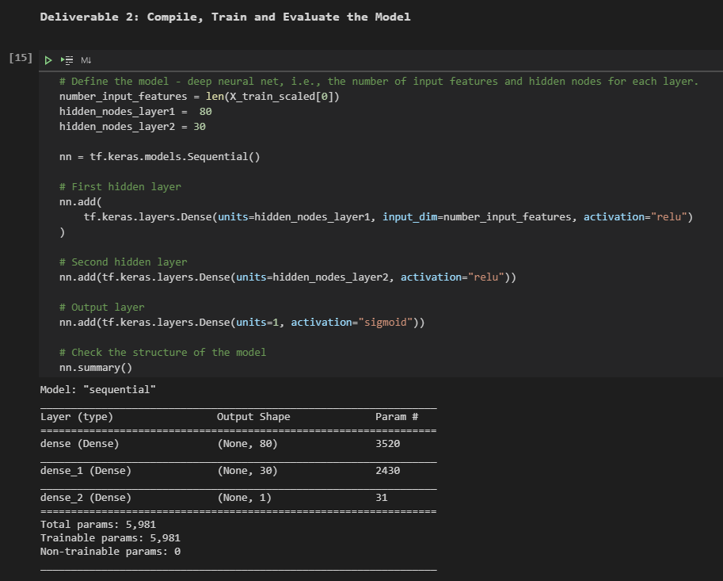
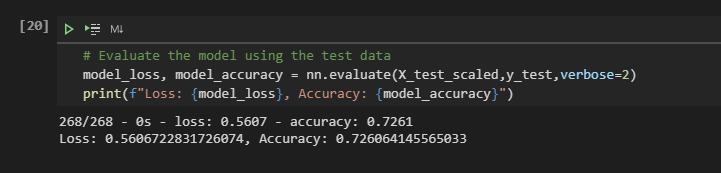
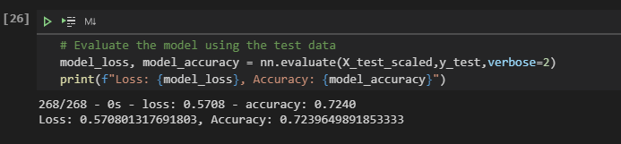
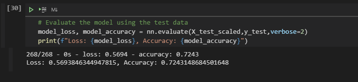
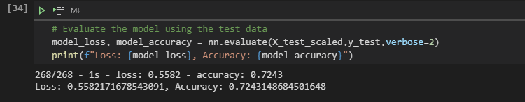
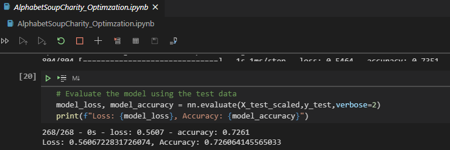

# Neural_Network_Charity_Analysis

## Purpose
The purpose of this challenge was to apply what we've learned about machine learning and **nueral networks**(deep learning). Based on the features within the dataset, a binary classifier will be created in order to predict *whether applicants will be successful if funded by Alphabet Soup*. The goal is to use the skills learned from the module to help the foundation predict where to make investments.

## Analysis/Results
The provided dataset used in this analysis is a [CSV](https://2u-data-curriculum-team.s3.amazonaws.com/dataviz-online/module_19/charity_data.csv) "containing more than 34,000 organizations that have received funding from Alphabet Soup over the years." 

Stepping through the deliverables, the following tasks will be performed on the data:
1. Preprocessing the data for a Nueral Network Model
2. Compile, Train and Evaluate the Model
3. Optimize the Model

### Deliverable 1: Data Preprocessing
*What variable(s) are considered the target(s) for your model?* 
For this model, the **IS_SUCCESSFUL** column stands as the target variable. The column denotes whether the money was used effectively.

*What variable(s) are considered to be the features for your model?* 
The following variables have been considered as features for the model: 
* APPLICATION_TYPE—Alphabet Soup application type 
* AFFILIATION—Affiliated sector of industry 
* CLASSIFICATION—Government organization classification 
* USE_CASE—Use case for funding 
* ORGANIZATION—Organization type 
* STATUS—Active status 
* INCOME_AMT—Income classification 
* SPECIAL_CONSIDERATIONS—Special consideration for application 
* ASK_AMT—Funding amount requested 

*What variable(s) are neither targets nor features, and should be removed from the input data?* 
**EIN** and **NAME** were flagged as neither a target nor a feature and were essentially dropped from the input data. Both variables were identification columns for the dataset and marked as ineffectual in the model's prediction capability. 

### Deliverable 2: Compiling, Training, and Evaluating the Model
*How many neurons, layers, and activation functions did you select for your neural network model, and why?* 
In using the nine features listed above, the nueral network model has been set for two hidden layers. 
At the first hidden layer, 80 neurons were the selected input based on the provided code using the relu activation function. 
At the second hidden layer, also based on the provided code, 30 neurons were the selected input using the relu activation function.  
The relu activation was used as it handles non-linear data and simplifies output better than other activation functions. 
Finally at the output layer, 1 neuron was applied using the sigmoid activation function to produce a probability output. 

*Were you able to achieve the target model performance?* 
The model's target performance was to achieve an accuracy of higher than 75%. After running the initial input, the model was shy of roughly 2.5% and only achieved **72.54%** accuracy.

### Deliverable 3: Optimization
*What steps did you take to try and increase model performance?* 
Since the original model missed its mark of achieving the desired 75% accuaracy target, three different approaches were taken in order to optimize the model.

1) **Adding an additional hidden layer and setting the hidden nodes to 20.** - At the chance the model may be underfitting, I felt adding an additional layer would be able to address that issue. Unfortunately, this attempt showed minimal improvements. In fact, it lowered the accuracy of the model to **72.40%**. 

2) **Add more nuerons to the original two layers.** - Since adding the additional layer lowered the model's accuracy, I decided to remove the added hidden layer and continue with the original two layers. Because the number of nuerons can also be a factor in over/underfitting, I decided to increase the preset nuerons. By increasing the first hidden layer from 80 to 100 nuerons and the second hidden layer from 30 to 60, the goal was to again try and address any form of underfitting. Unfortunately, I came up still a little short from both the target goal and the original accuracy. While this model performed better than my first optimization attempt with **72.43%** accuracy, it still wasn't enough.

3) **Changing the activation function of all hidden layers**. - Finally, with the last attempt at optimization, I decided to keep the number of nuerons from the second attempt since it did have some marked improvements. In addition, I wanted to see if changing the activation function would make any difference to the model performance. Hence, all the activation functions at all layers (first, second, and output) were changed from "relu" to "sigmoid". Based on the results, changing activation functions made no improvements to the accuracy score and stayed at **72.43%**. 

Furthermore, as we can see from the results, all attempts to optimize the model failed without any marked improvements to the original model.

### Challenges

*Working with the dataset, I ran into a few challenges.*  
(1) Unable to achieve optimization. In addition, I noticed a slight difference when I copied the `AlphaetSoupCharity.ipynb` and built upon the code with `AlphaetSoupCharity_Optimization.ipynb`. With the optimization code, I added all my attempts for enhancement. However, when I ran the whole notebook through as one swoop, I noticed that the accuracy of the "initial" model showed slight improvement from 72.54% to 72.61% . 

  To me, it was interesting to see that shift as there is no difference between the two notebook codes.

(2) I was having issues trying to create a callback at every 5 epochs. I was able to get assistance on stackoverflow to assign variables; however, I kept getting errors related to `train_labels.size` (see code block 18 in the `AlphaetSoupCharity.ipynb` notebook). I searched through the internet in order to get the correct dependency, but was unable to find a solution. I ended trying to install MNIST, but that also didn't help. Instead, I went ahead and hardcoded the `save_freq` input to reflect the size (804) and multiplied it by the epoch frequency (5), which should be a rough save frequency of 4000.

## Summary
*Include a recommendation for how a different model could solve this classification problem, and explain your recommendation.* 
While the target accuracy was never achieved, the original model was the closest to 75% accuracy. Another model to compare for accuracy and consider to solve this classification problem is using Random Forest. It can be argued why Random Forest is better than a Nueral Network or vice versa, but I think it's imperative to ask what is important to the customer. 

With the Nueral Network, the features lose their descriptive values and "repurposed" for the sake of model performance. If the categorical variables weren't important to the customer, the Nueral Network approach would suffice. On the other hand, in this scenario, it seems that the company would need these categorical values as it helps them understand which charities are successful. Hence, with the Random Forest, I think it would help address that as it can provide the interpretation of a decision tree, only with better performance. In addition, the Random Forest might also be able to address any issues with overfitting (if it applies).  

All in all, they are both different techniques that learn differently and it comes down to the final ask. Here, we want to know which charities funded by AlphabetSoup are successful and not necessarily how accurate is the model. With the Nueral Network, some of those details get lost early on; hence, I think the Random Forest might fare better with the customer in the long run. 
